# Приложение авторизация

# Используемые библиотеки
- bloc
- crypto
- sqflite
- shared_preferences
- intl

# Экран успешной авторизации 
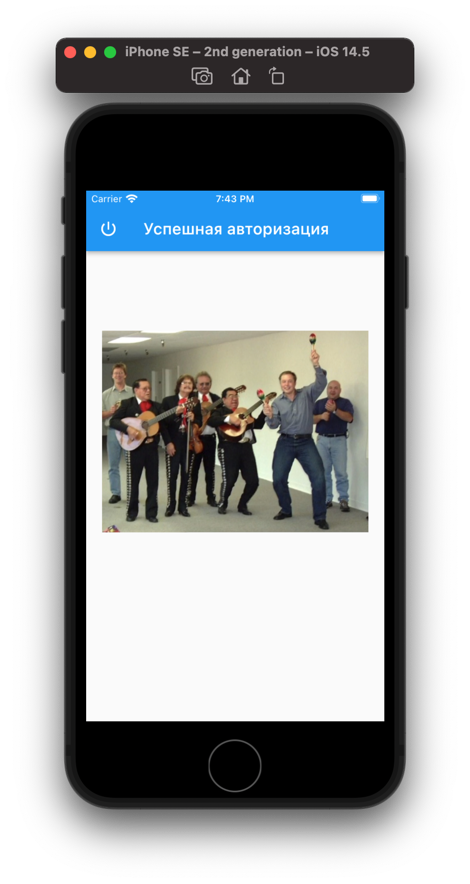

# Экран авторизации после регистрации
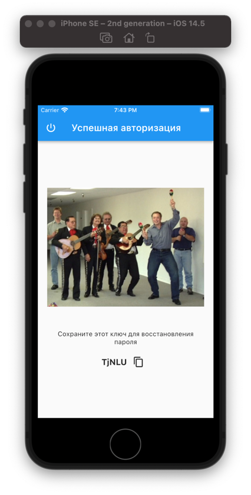

# Экран ошибки
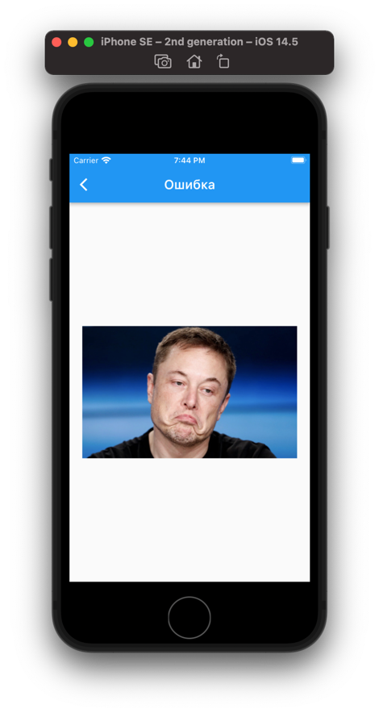

# Домашний экран
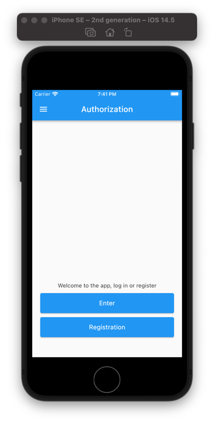

# Смена языка
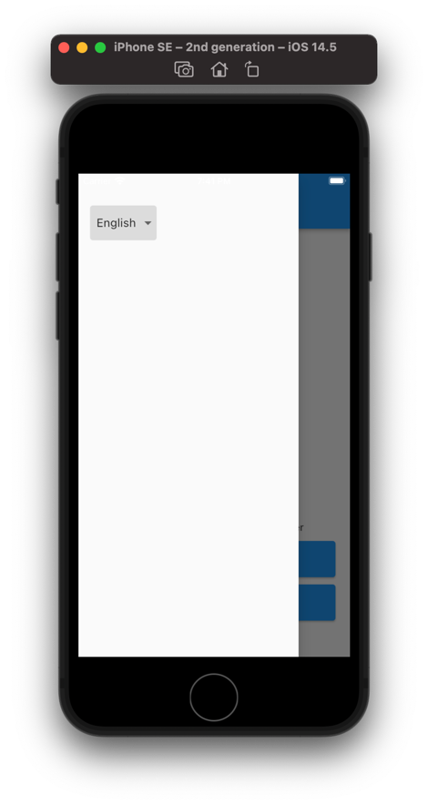

# Вход в приложение
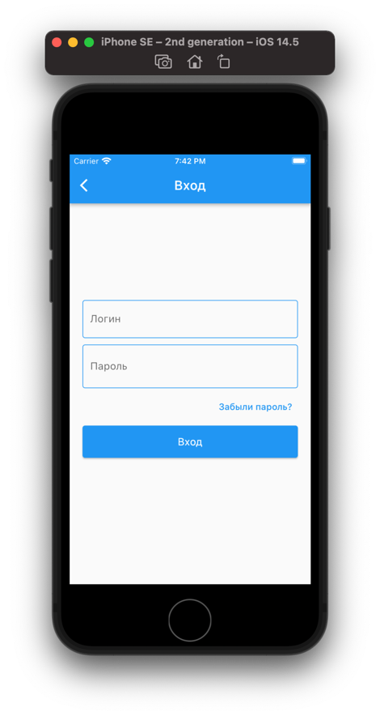
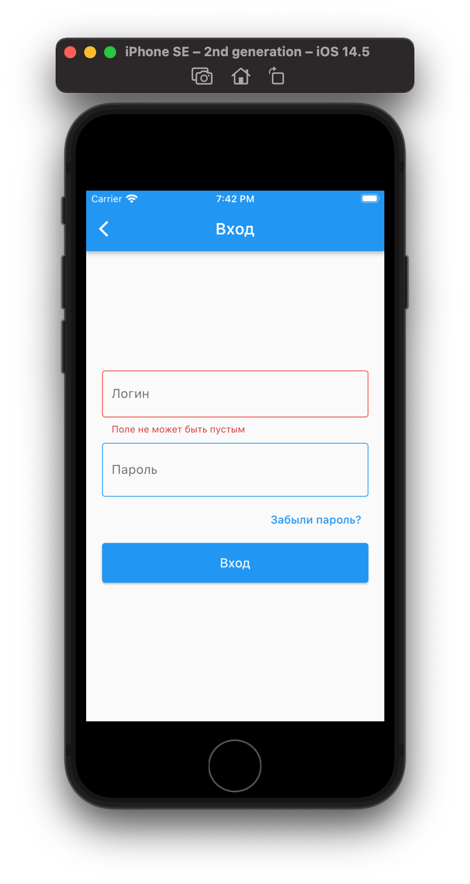

# Экран восстановление пароля
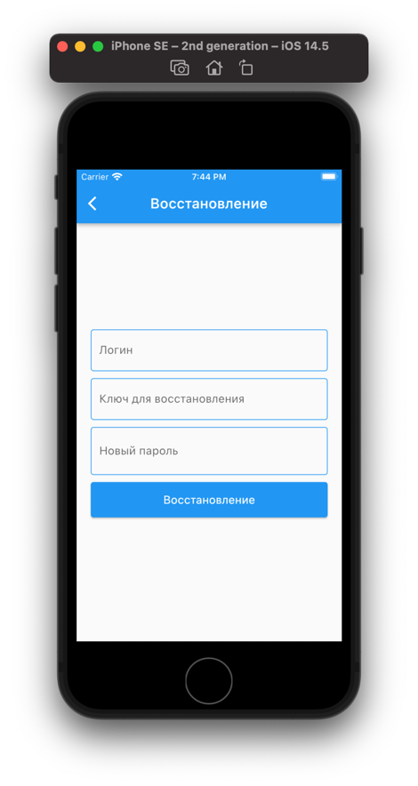
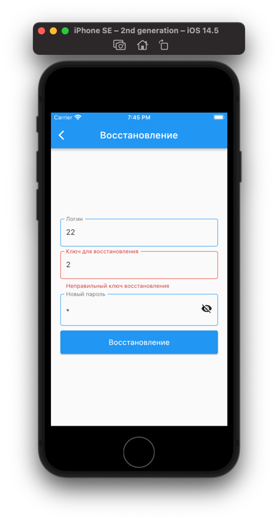

# Экран регистраци
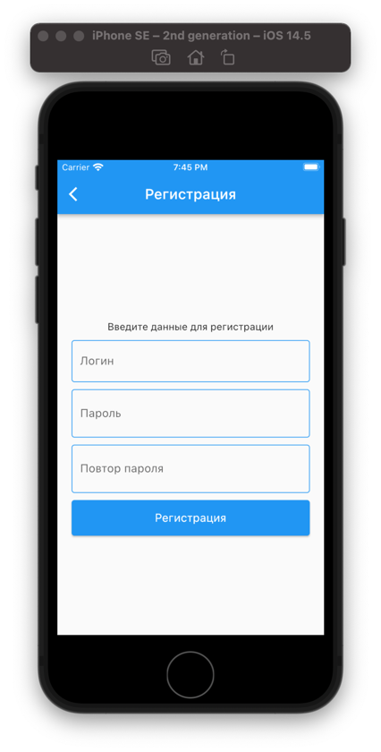
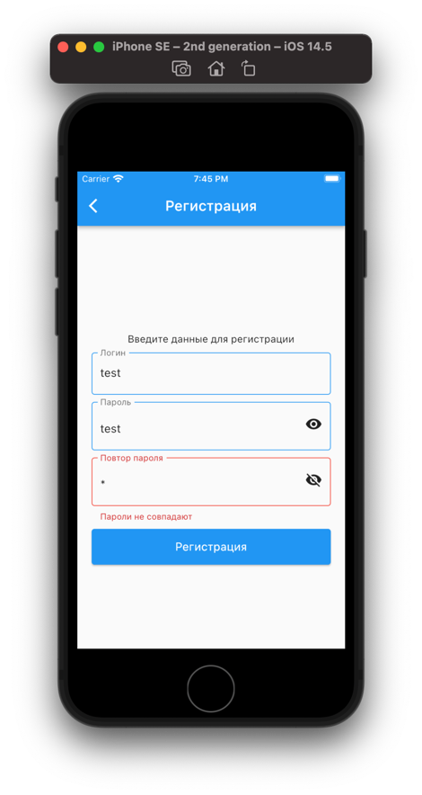
